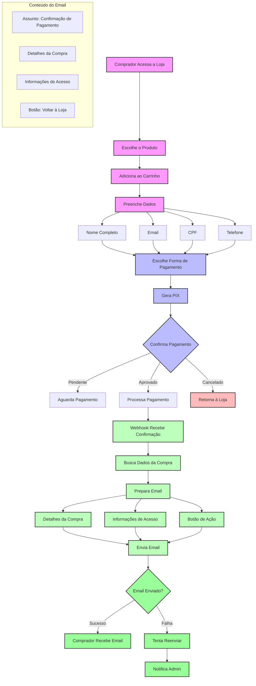
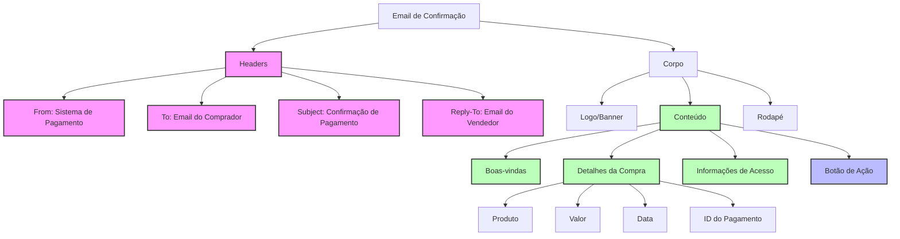
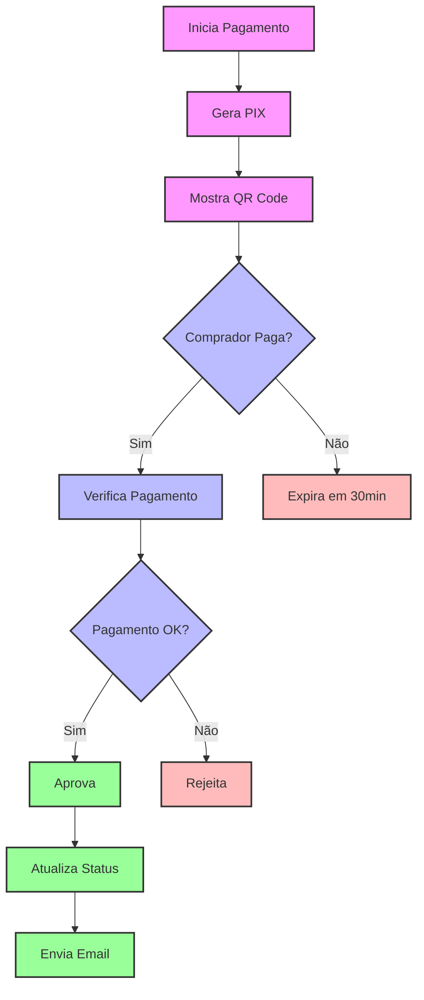

# Fluxo do Comprador

```mermaid
graph TD
    %% Estilo dos nós
    classDef process fill:#f9f,stroke:#333,stroke-width:2px
    classDef decision fill:#bbf,stroke:#333,stroke-width:2px
    classDef email fill:#bfb,stroke:#333,stroke-width:2px
    classDef error fill:#fbb,stroke:#333,stroke-width:2px
    classDef success fill:#9f9,stroke:#333,stroke-width:2px

    %% Fluxo Principal
    A[Comprador Acessa a Loja] --> B[Escolhe o Produto]
    B --> C[Adiciona ao Carrinho]
    C --> D[Preenche Dados]
    
    %% Dados do Comprador
    D --> D1[Nome Completo]
    D --> D2[Email]
    D --> D3[CPF]
    D --> D4[Telefone]
    
    %% Processo de Pagamento
    D1 & D2 & D3 & D4 --> E[Escolhe Forma de Pagamento]
    E --> F[Gera PIX]
    F --> G{Confirma Pagamento}
    
    %% Fluxo de Aprovação
    G -->|Pendente| H[Aguarda Pagamento]
    G -->|Aprovado| I[Processa Pagamento]
    G -->|Cancelado| J[Retorna à Loja]
    
    %% Processo de Email
    I --> K[Webhook Recebe Confirmação]
    K --> L[Busca Dados da Compra]
    L --> M[Prepara Email]
    
    %% Detalhes do Email
    M --> N[Detalhes da Compra]
    M --> O[Informações de Acesso]
    M --> P[Botão de Ação]
    
    %% Envio do Email
    N & O & P --> Q[Envia Email]
    Q --> R{Email Enviado?}
    
    %% Resultados
    R -->|Sucesso| S[Comprador Recebe Email]
    R -->|Falha| T[Tenta Reenviar]
    T --> U[Notifica Admin]
    
    %% Conteúdo do Email
    subgraph "Conteúdo do Email"
        V[Assunto: Confirmação de Pagamento]
        W[Detalhes da Compra]
        X[Informações de Acesso]
        Y[Botão: Voltar à Loja]
    end
    
    %% Estilização
    class A,B,C,D process
    class E,F,G decision
    class K,L,M,N,O,P,Q email
    class R,S,T,U success
    class J error
```

## Detalhes do Email

```mermaid
graph TD
    %% Estilo dos nós
    classDef header fill:#f9f,stroke:#333,stroke-width:2px
    classDef content fill:#bfb,stroke:#333,stroke-width:2px
    classDef button fill:#bbf,stroke:#333,stroke-width:2px

    %% Estrutura do Email
    A[Email de Confirmação] --> B[Headers]
    A --> C[Corpo]
    
    %% Headers
    B --> B1[From: Sistema de Pagamento]
    B --> B2[To: Email do Comprador]
    B --> B3[Subject: Confirmação de Pagamento]
    B --> B4[Reply-To: Email do Vendedor]
    
    %% Corpo do Email
    C --> D[Logo/Banner]
    C --> E[Conteúdo]
    C --> F[Rodapé]
    
    %% Conteúdo Principal
    E --> E1[Boas-vindas]
    E --> E2[Detalhes da Compra]
    E --> E3[Informações de Acesso]
    E --> E4[Botão de Ação]
    
    %% Detalhes da Compra
    E2 --> E2A[Produto]
    E2 --> E2B[Valor]
    E2 --> E2C[Data]
    E2 --> E2D[ID do Pagamento]
    
    %% Estilização
    class B,B1,B2,B3,B4 header
    class E,E1,E2,E3,E4 content
    class E4 button
```

## Processo de Pagamento

```mermaid
graph TD
    %% Estilo dos nós
    classDef process fill:#f9f,stroke:#333,stroke-width:2px
    classDef decision fill:#bbf,stroke:#333,stroke-width:2px
    classDef success fill:#9f9,stroke:#333,stroke-width:2px
    classDef error fill:#fbb,stroke:#333,stroke-width:2px

    %% Fluxo de Pagamento
    A[Inicia Pagamento] --> B[Gera PIX]
    B --> C[Mostra QR Code]
    C --> D{Comprador Paga?}
    
    %% Verificação
    D -->|Sim| E[Verifica Pagamento]
    D -->|Não| F[Expira em 30min]
    
    %% Resultados
    E --> G{Pagamento OK?}
    G -->|Sim| H[Aprova]
    G -->|Não| I[Rejeita]
    
    %% Processamento
    H --> J[Atualiza Status]
    J --> K[Envia Email]
    
    %% Estilização
    class A,B,C process
    class D,E,G decision
    class H,J,K success
    class F,I error
``` 