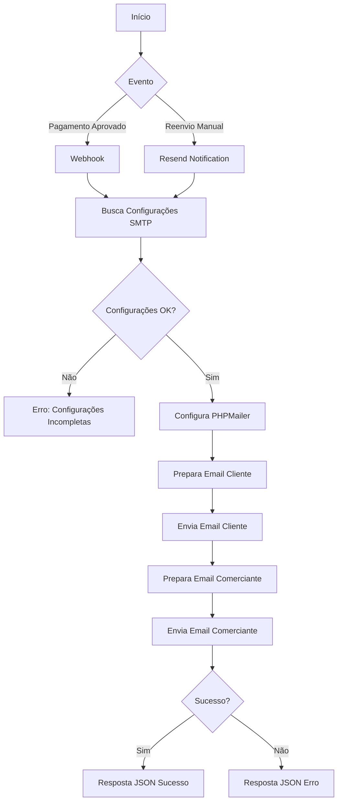
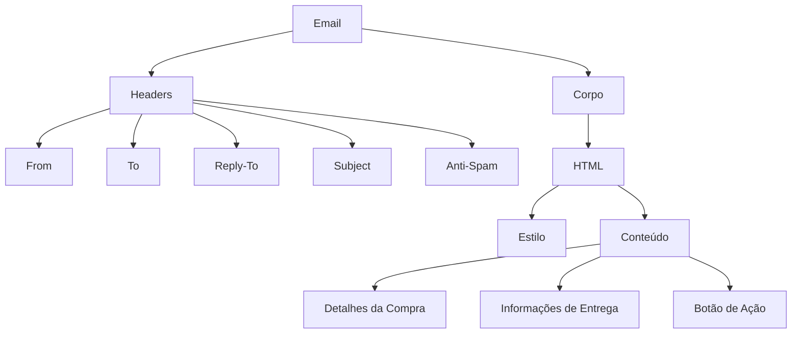
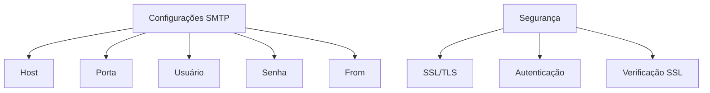
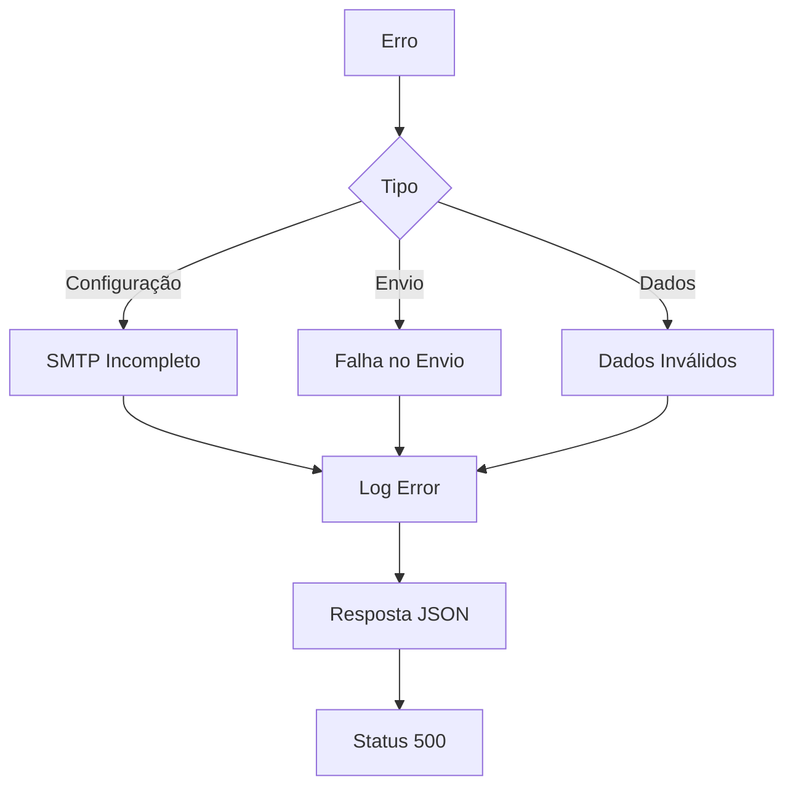
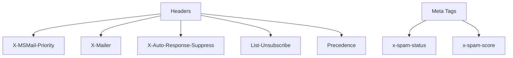
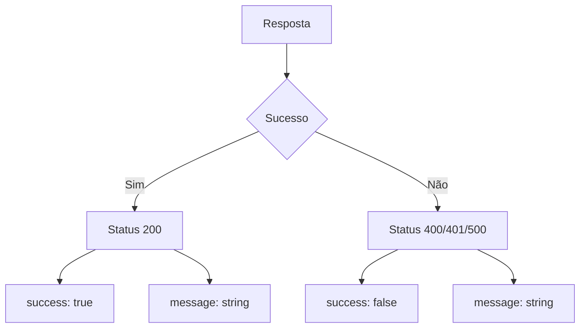
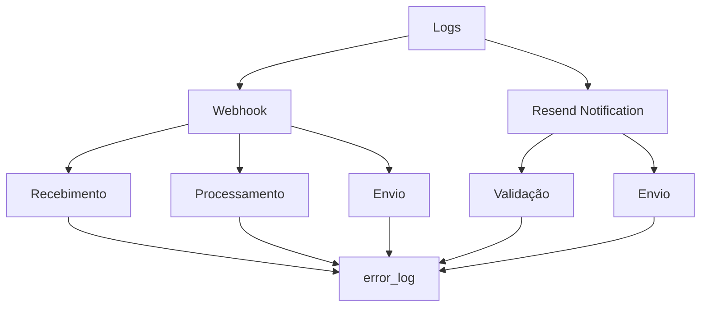

# Documentação do Sistema de Emails

## Fluxo de Envio de Emails

## Estrutura dos Emails

## Configurações SMTP

## Tratamento de Erros

## Headers Anti-Spam

## Formato da Resposta JSON

## Logs do Sistema

